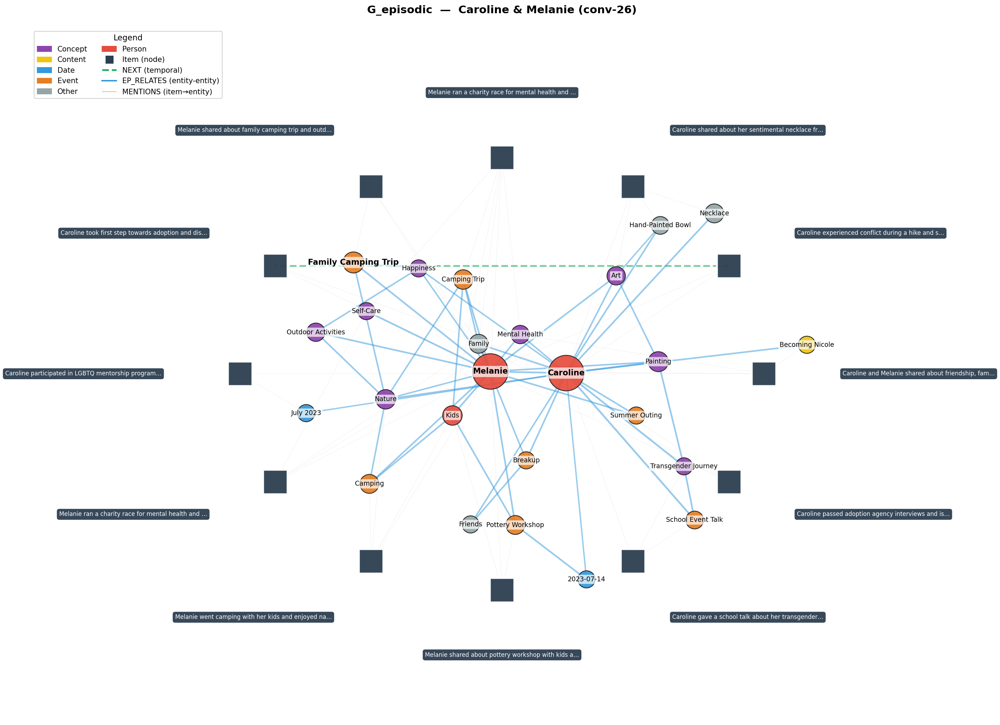
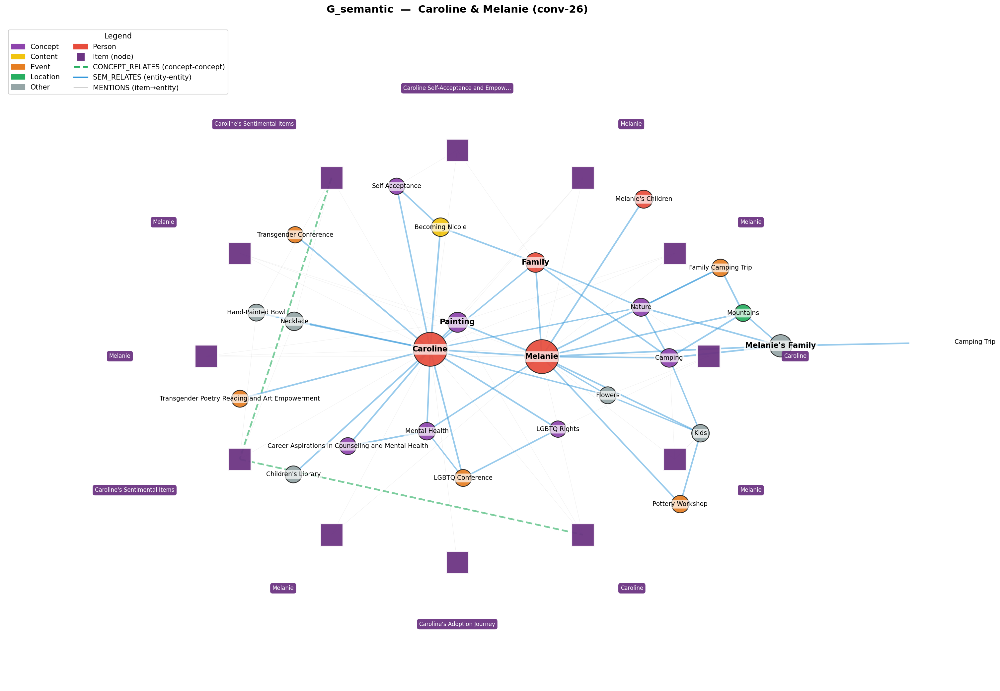

# v4 Graph Memory Patch

LightRAG-style dual-graph memory for MIRIX. Adds two independent Neo4j graphs
(G_episodic for events, G_semantic for concepts), each with LightRAG dual-level
retrieval (entity name + relation keyword vectors), and dispatches retrieval
to both graphs in parallel.

## Visualizations (LoCoMo conv-26, Caroline & Melanie)

Whole-graph overviews, top-N entities + items, force-directed layout:

| Episodic graph | Semantic graph |
|---|---|
|  |  |

Same seed entity ("Painting" / "Camping" / identity-related) in both graphs,
showing how each layer organizes the topic differently:

- `kg_subgraph_identity.png` — Transgender Journey (episodic) vs Self-Acceptance (semantic)
- `kg_subgraph_family_camping.png` — Family Camping Trip vs Camping concept
- `kg_subgraph_art_creativity.png` — Painting episode-side vs Painting concept-side

## Source

See [v4_graph_memory.md](v4_graph_memory.md) for per-file source and diffs
(new files in full, modifications as unified diffs).

## What changes

### New files (14)

**Neo4j infrastructure**
- `mirix/database/neo4j_client.py` — async driver + schema bootstrap (6 constraints, 5 vector indexes)
- `mirix/database/startup_migrations.py` — PG migration framework (drops v2 graph tables)
- `mirix/database/token_tracker.py` — server-side token usage counter

**LightRAG building blocks (shared)**
- `mirix/prompts/lightrag_prompts.py` — entity extraction + keyword extraction + summarize prompts
- `mirix/services/lightrag_extractor.py` — LLM-driven entity/relation extraction with delimiter parsing
- `mirix/services/lightrag_keyword_extractor.py` — query keyword extraction (ll/hl), Redis-cached
- `mirix/services/lightrag_merger.py` — map-reduce description merge

**Two-graph write managers**
- `mirix/services/_graph_common.py` — shared helpers (gen_id, normalize_name, embed_batch)
- `mirix/services/episodic_graph_manager.py` — writes G_episodic (`:Episode`, `:EpisodicEntity`, `[:NEXT]`, `[:EP_RELATES]`, `[:MENTIONS]`)
- `mirix/services/semantic_graph_manager.py` — writes G_semantic (`:Concept`, `:SemanticEntity`, `[:CONCEPT_RELATES]`, `[:SEM_RELATES]`, `[:MENTIONS]`)

**Two-graph retrievers**
- `mirix/services/_graph_retriever_base.py` — shared base with ll/hl Cypher + round-robin merge + budget
- `mirix/services/episodic_graph_retriever.py` — searches G_episodic + MENTIONS reverse + NEXT one-hop
- `mirix/services/semantic_graph_retriever.py` — searches G_semantic + MENTIONS reverse + CONCEPT_RELATES one-hop
- `mirix/services/graph_retriever_dispatcher.py` — keyword extract → embed batch → dispatch both retrievers in parallel → combined markdown

### Modified (12)

- `docker-compose.yml` — adds `neo4j:5.20-community` service + `MIRIX_NEO4J_*` env wiring
- `mirix/settings.py` — adds `neo4j_uri`, `neo4j_user`, `neo4j_password`, `neo4j_database`, `neo4j_vector_dim`
- `mirix/server/server.py` — calls `run_startup_migrations` before `Base.metadata.create_all`
- `mirix/server/rest_api.py` — Neo4j init in lifespan, `/debug/token_stats` endpoints, dispatcher hook in `retrieve_memories_by_keywords`
- `mirix/services/episodic_memory_manager.py` — sync hook after PG insert calls `EpisodicGraphManager.process_episode`
- `mirix/services/semantic_memory_manager.py` — sync hook after PG insert calls `SemanticGraphManager.process_concept`
- `mirix/llm_api/openai.py` — records token usage to tracker after each chat completion
- `mirix/orm/__init__.py` — drops v2 ORM imports
- `requirements.txt` — `neo4j>=5.20.0,<6.0.0`
- `evals/main_eval.py` — token tracker reset/snapshot per sample; saves `token_stats` to per-sample JSON
- `evals/mirix_memory_system.py` — client timeout 60s → 600s (v4 ingest is slow)
- `evals/task_agent.py` — same timeout bump

### Deleted (2)

- `mirix/orm/graph_memory.py` — v2 single-graph ORM (`EntityNode`, `EntityEdge`, etc)
- `mirix/services/graph_memory_manager.py` — v2 manager

## Configuration

When you want to use graph memory:

```bash
# .env
MIRIX_ENABLE_GRAPH_MEMORY=true
MIRIX_NEO4J_URI=bolt://neo4j:7687
MIRIX_NEO4J_USER=neo4j
MIRIX_NEO4J_PASSWORD=mirix_neo4j_dev
```

Then start the stack with the `graph` profile so Neo4j comes up:

```bash
docker compose --profile graph up -d
```

## Zero-overhead default

The flag is `false` by default. With graph memory off, every patch addition
is a no-op:

- The hooks in `episodic_memory_manager.insert_event` and
  `semantic_memory_manager.insert_semantic_item` are guarded by
  `if settings.enable_graph_memory:`.
- `init_neo4j_client()` returns `None` immediately, never opens a connection.
- The `GraphRetrieverDispatcher` short-circuits to an empty string at the
  same flag check, so retrieval payloads are unchanged.
- The Neo4j compose service is profile-gated (`profiles: ["graph"]`) and
  `mirix_api`'s dependency on it is `required: false`, so plain
  `docker compose up` skips Neo4j entirely.
- The token tracker (`mirix/database/token_tracker.py`) is disabled by
  default; `record()` is a no-op until `enable()` is called (the eval
  harness flips it via `POST /debug/token_stats/reset`).

The only unconditional additions are:
- `neo4j>=5.20.0` in `requirements.txt` (~600KB pip install)
- ~10 lines of guarded code in pre-existing files

If you don't enable graph memory, behavior is identical to upstream.

## Tested with

- `gpt-4.1-mini` (extraction + answer)
- `text-embedding-3-small` (entity / relation keyword embeddings)
- Neo4j 5.20-community (vector indexes require ≥5.13)
- LoCoMo conv-26: 154 QA, ~30 min ingest + retrieve + judge

## Known limitations

1. **TokCost(Build) instrumentation** covers OpenAI chat completions only;
   embeddings + Anthropic/Gemini paths are not yet wrapped.
2. **No cross-graph entity linking** — "Caroline" in G_episodic and G_semantic
   are distinct nodes by design; cross-graph reasoning happens at the LLM layer
   when both KG sections appear in the prompt.
3. **Concept→Concept LLM judgement** adds ~1 LLM call per semantic insert.
   Disable by patching `SemanticGraphManager._discover_concept_relations` to
   return 0 unconditionally if cost is a concern.
