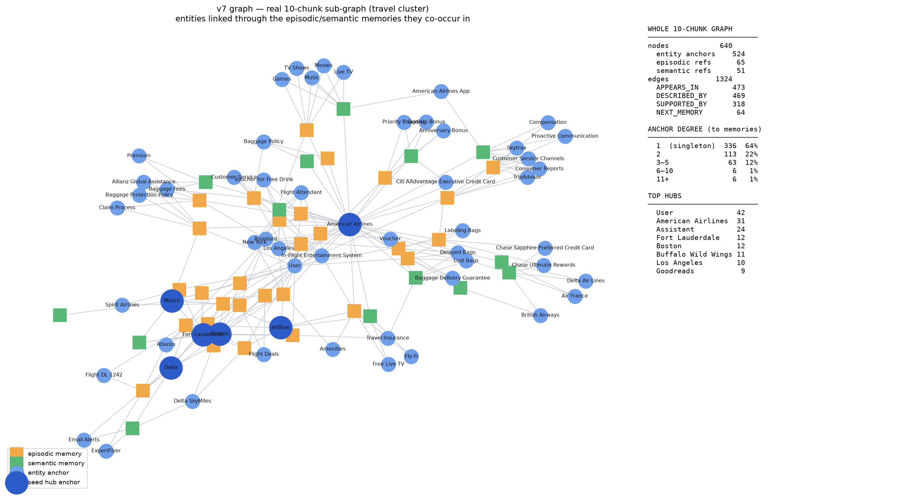

# v7 Graph — 10-chunk Ingest Analysis (LongMemEval-S)

A controlled 10-session-chunk ingest of LongMemEval-S with the standard 6-agent
memory pipeline and `MIRIX_GRAPH_VERSION=v7`. The goal was a fast, valid slice of
the full 114-chunk build to sanity-check that graph size scales as expected — and
it surfaced a harness/ingest pitfall worth documenting.

- **DB**: `mirix_lm10` (fresh), `user_id = longmem_s_0`, `mirix-eval-org`
- **Graph**: v7, on (`MIRIX_ENABLE_GRAPH_MEMORY=true`)
- **Ingest**: first 10 of 114 session chunks, standard `add_chunk` (meta-agent →
  6 sub-agents), `chaining=False`, `occurred_at` supplied per session
- **Config**: `evals/configs/0201c_v6.yaml`

## TL;DR

The first attempt (via `longmem_eval.py --max-chunks 10`) produced only **20
memories / 62 anchors** — ~8× too few. That run was **broken**: its `add_chunk`
calls returned without actually extracting (the whole ingest+QA finished in ~8
min, when ingest alone should take ~22 min). A clean re-ingest that lets each
chunk complete produces **116 memories / 524 anchors**, which is exactly
proportional to the full 114-chunk graph.

## Numbers

| | Full (114 ch) | **Correct 10 ch** | Broken 10 ch (first try) |
|---|---:|---:|---:|
| episodic + semantic memories | 1219 | **116** (65 ep + 51 sem) | 14 |
| memories per chunk | 10.7 | **11.6** | 1.4 |
| anchors (V7Anchor) | 5588 | **524** | 62 |
| total graph nodes | — | **640** | 76 |
| total graph edges | — | **1324** | 117 |
| anchors per memory | 4.58 | **4.52** | 4.43 |

The **anchors-per-memory ratio is invariant (~4.5)** across all three runs — the
graph builder is fine. The only thing that changed between the broken and correct
10-chunk runs is the *number of memories extracted*. A correct 10-chunk ingest
lands right on (even slightly above) the full run's per-chunk rate; the first 10
sessions are marginally richer than the 114-chunk average.

Graph edge breakdown (correct run):

| edge | count | meaning |
|---|---:|---|
| `V7_APPEARS_IN` | 473 | anchor → episodic ref |
| `V7_DESCRIBED_BY` | 469 | anchor → semantic (concept) ref |
| `V7_SUPPORTED_BY` | 318 | concept ↔ episodic cross-evidence |
| `V7_NEXT_MEMORY` | 64 | temporal chain between episodic refs |

## Root cause of the broken run

`MirixMemorySystem.add_chunk` uses `async_add=False` and is **fully
synchronous**: each call blocks until the chunk is completely extracted and
committed. Measured on the correct run:

- chunk 1: +141 s, +12 memories
- 10 chunks: ~1328 s total (~2.2 min/chunk)
- After the last `add_chunk`, the count was **immediately stable at 116** — a
  45 s post-ingest watch showed **zero** additional growth.

That last observation **refutes an earlier "async queue didn't drain" hypothesis**:
there is no async lag to wait out. Extraction happens inline inside `add_chunk`.

So the broken run — which finished ingest+QA in ~8 min — cannot have run the real
extraction (10 chunks alone need ~22 min). Its `add_chunk` calls returned fast
and near-empty. The broken run happened immediately after killing a prior ingest,
recreating the DB, and restarting the server; the most likely cause is a
**transient: the fresh server/agents were not fully ready for the first ingest
batch**, so per-chunk calls short-circuited. It did not self-heal (the count
stayed pinned at 20), consistent with the work never being enqueued rather than
being dropped from a queue.

### Practical guard

To get a valid ingest, confirm the memory count grows at the expected rate
*during* ingest (≈10–12 memories/chunk) rather than trusting that the harness
finished. The helper `~/MIRIX_eval/ingest_drain.py` re-uses the exact `add_chunk`
path, prints a per-chunk count, and then watches until the count is stable — use
it (or the same pattern) when a run completes suspiciously fast.

### Unrelated reporting bug

`longmem_eval.py::measure_memory_size` shells out to a hard-coded macOS psql path
(`/usr/local/opt/postgresql@17/bin/psql`) via `PSQL_BIN`, which does not exist on
this Linux host, so it silently reports `flat rows = 0` regardless of the true
memory state. It is cosmetic (QA retrieval goes through the server, not this
function) but is misleading in logs — it reads the `PSQL_BIN` env var, not the
`MIRIX_PG_BIN` we set in `.env`.

## Graph shape



Left: a real sub-graph seeded on the travel cluster; right: whole-graph stats.
Anchors are never linked directly — two entities connect only *through the
episodic/semantic memory they co-occur in* (`anchor → memory → anchor`), which is
what makes the graph useful for multi-hop retrieval.

**Degree distribution (anchor → memories):**

| degree | anchors | share |
|---|---:|---:|
| 1 (singleton) | 336 | 64% |
| 2 | 113 | 22% |
| 3–5 | 63 | 12% |
| 6–10 | 6 | 1% |
| 11+ | 6 | 1% |

**Top hubs:** User (42), American Airlines (31), Assistant (24),
Fort Lauderdale (12), Boston (12), Buffalo Wild Wings (11), Los Angeles (10),
Miami (9), Goodreads (9), JetBlue/Delta/Road Bike (6).

Two structural notes that match prior findings:

1. **64% of anchors are singletons** (connect to exactly one memory). These are
   the target of the v8 singleton-prune finalize pass — removing them cost ~0
   retrieval accuracy in A/B tests while cutting anchor count 60–71%.
2. **`User` (42) and `Assistant` (24) are semantics-free mega-hubs** — pure
   structural noise from the dialogue roles. Dropping them (the ad-hoc "v8.1"
   experiment) was net-negative because `User` doubles as an aggregation point,
   so they are kept.

The 10 ingested sessions are thematically a travel/airline/reading conversation,
so the graph self-organizes into clean clusters: cities & airlines (Boston,
Fort Lauderdale, Miami, Delta, JetBlue, Spirit, Air France), service/review
(Skytrax, TripAdvisor, Consumer Reports), credit-card rewards (Chase Sapphire,
Chase Ultimate Rewards, Citi AAdvantage), and in-flight entertainment.

## Reproduce

```bash
# fresh DB + empty graph, server on mirix_lm10 / v7 / graph on
# then, from ~/MIRIX_eval with .env sourced:
MAX_CHUNKS=10 ./.venv/bin/python ingest_drain.py   # ingest + drain-watch
# figure:
./.venv/bin/python draw_lm10_graph.py              # -> lm10_v7_graph.png
```
